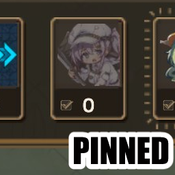
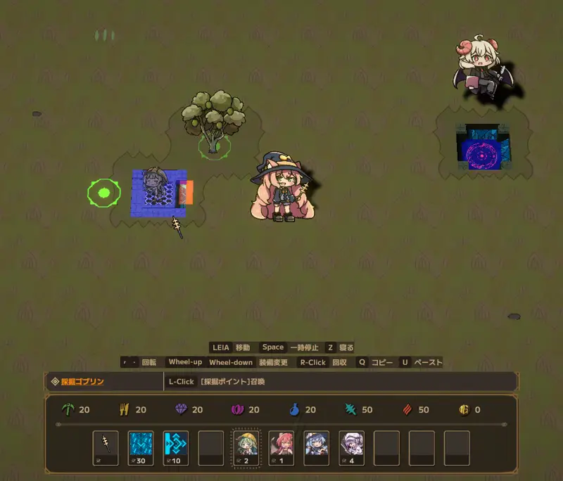
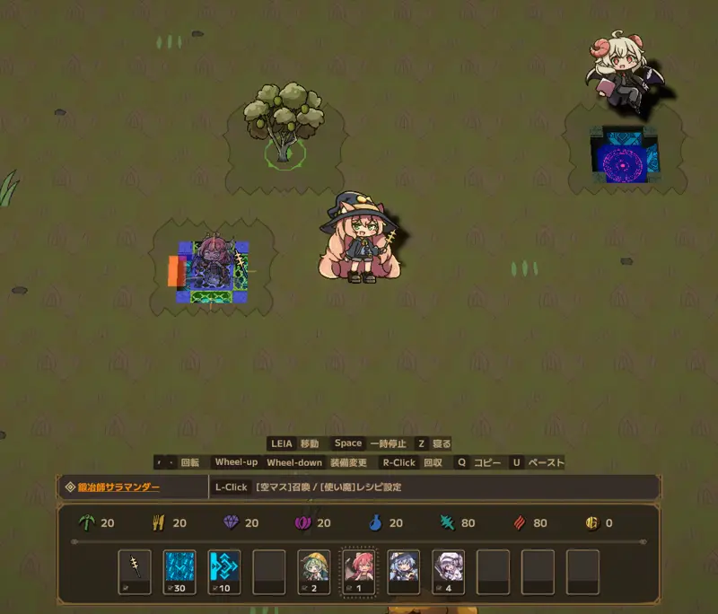

[English](README.en.md)

# LWF Pinned Slots

**Lazy Witch's Factory** 所持品欄のアイコンの場所を固定する MOD

**[最新版をダウンロード](https://github.com/KiyonakaNata/lwf-pinned-slots/releases/latest)** ／ **[Thunderstore](https://thunderstore.io/c/lazy-witchs-factory/p/KiyonakaNata/LwfPinnedSlots/)**（MOD管理ソフトでお手軽導入）

---

## できること

### アイコンの場所を固定

所持品欄のアイコン表示位置を固定する

- 固定した場所には印が付く
- 在庫 0 の場所は薄いアイコンと「0」

### 固定・解除

セルを右クリック

| 場所 | 結果 |
|---|---|
| 固定していない場所 | その品目を固定 |
| 固定している場所 | 解除 |

### 入れ替え

セルをドラッグして別のセルに落とす

- 中身と固定が一緒に移る
- 落とし先に品目があれば入れ替わる

---

## 入れかた（手で入れる場合）

1. **BepInEx 5** を入れる — [配布元](https://github.com/BepInEx/BepInEx/releases)
   - `BepInEx_win_x64_5.4.x.zip` を落とす
   - 中身をゲームのフォルダ（`LazyWitchsFactory.exe` と同じ場所）へ展開する

     > **ゲームのフォルダの場所**（Steam）
     > ライブラリでゲームを右クリック → 管理 → ローカルファイルを閲覧

2. 一度ゲームを起動して終了すると、`BepInEx/plugins` などが作られる
3. このMODの zip の中の `LwfPinnedSlots.dll` を **`BepInEx/plugins/` に入れる**
4. ゲームを起動し、所持品欄のセルを右クリックして印が付くことを確認する

## 消しかた

**このMODだけ消す**

- `BepInEx/plugins/LwfPinnedSlots.dll`
- 設定も消すなら `BepInEx/config/kiyonakanata.lwfpinnedslots.cfg`

**BepInEx ごと消す**（他のMODも全部止まる）

- `BepInEx` フォルダ
- ゲームのフォルダにある `winhttp.dll`、`doorstop_config.ini`、`.doorstop_version`

---

## 設定

`BepInEx/config/kiyonakanata.lwfpinnedslots.cfg`（ゲームを一度起動すると作られる）

場所の固定は cfg を書き換えず、ゲーム内の右クリック・ドラッグで変える

**[1. General]**

| 項目 | 既定 | 値 |
|---|---|---|
| Enabled | `true` | |

**[3. View]** — 変更は不要。印と数字の見た目を変えるときだけ

| 項目 | 既定 | 値 |
|---|---|---|
| Show 0 and 1 on pinned slots | `true` | |
| Empty pinned slot icon brightness (%) | `35` | 0〜100 |
| Pin marker size | `14` | 2〜64 |
| Pin marker color | `#FFFFFF` | `#RRGGBB` |

---

## 動作の条件

| | |
|---|---|
| Lazy Witch's Factory | **ver 0.29.1** で動作確認 |
| BepInEx | **5.4.23.5** で確認（5.4.x なら動くはず） |

本体の更新で動かなくなったら、このMODの寿命なので消すこと

## うまく動かないとき

まず `BepInEx/LogOutput.log` を見る

| ログ | いまどうなっているか |
|---|---|
| `[boot] LWF Pinned Slots ...` が無い | **読まれていない** — DLL の置き場所を確認 |
| `patches=2` 未満 | **働いていない** — ゲームの版が合っていない |

**不具合の報告**には次の2つを添えること

- 画面の写真
- `BepInEx/LogOutput.log`

---

## 免責

- **非公式のMOD** — 公式のサポート対象外
- MODを入れた状態で起きた不具合・クラッシュ・セーブデータの破損などは自己責任
- [公式のMODに関する方針](https://store.steampowered.com/news/app/3971650/view/699897618302503133)に従って作成

ソースコードは MIT ライセンス（`img/` のスクリーンショットはゲーム画面の写しで、権利は開発元に帰属）
